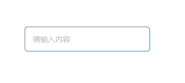

# BaseControls

这个是一个漂亮的Qt组件库，其样式参考自<a href="https://element.eleme.cn/#/zh-CN">Element</a>。

## 已实现的组件：

|       类名       |    说明    |
| :--------------: | :--------: |
| LJBDefaultButton |  默认按钮  |
|   LJBLineEdit    | 基础输入框 |

## 效果预览：

